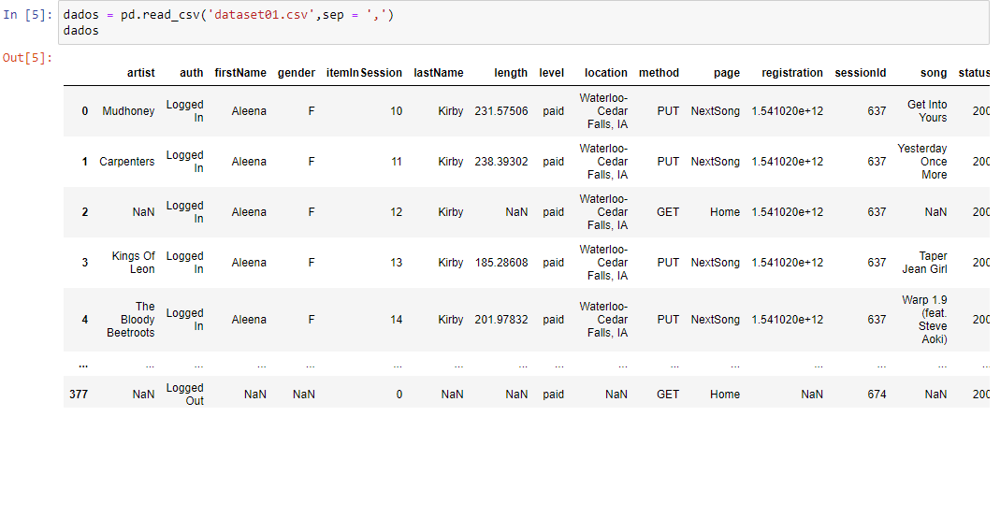

###Pipeline ETL em Python para a Cargas de Dados e Analytics usando o Apache Cassandra

##### O objetivo deste projeto é utilizar linguagem Python para construir um pipeline completo, desde a extração, transformação e a carga de dados. Após a etapa de ETL foi realizado o processo de analytics utilizando o Apache Cassandra.

##### Neste projeto foi utilizado uma VM na AWS e sistema operacional Linux. Após subir a máquina o primeiro passo foi instalar o Apache Cassandra. 

#### __Apache Cassandra__

##### O Apache Cassandra é um banco de dados não relacional (NoSQL), distribuido e open source desenvolvido inicialmente pelo Face Book. Com o Cassandra é possível trabalhar em ambiente on premise ou em nuvem. A liguagem de consulta é o CQL, ou seja, uma adaptação do SQL.

#### __O probema de negócio__

##### Utilizando dados de usuários de portais de música na internet responder as seguintes questões:

##### 1. Qual o artista e o comprimento (tempo) da música do sessionId = 436 e itemInSession = 12?

##### 2- Quais músicas o usuário do userid = 54 e sessionid = 616 ouviu? Retorne o nome do artista, o nome da música e nome e sobrenome do usuário.

##### 3- Quais usuários ouviram a música 'The Rhythm Of The Night'? 

#### __Os dados__

##### O dados utilizados neste projeto são trinta arquivos CSV, contendo informações sobre o uso de portais de música na internet. Seguem abaixo as fontes dos dados utlizados:

<http://millionsongdataset.com/>
<https://data.world/baltimore/baltimore-arts-organizations>

##### Na figura abaixo temos um desses trinta arquivos:

#### __Procedimento__

##### Após instalar o Cassandra o próximo passo foi instalar o driver para que o script python consiga fazer a conexão com o Cassandra. Em seguida o Anaconda foi instalado.

##### O próximo passo foi concatenar os 30 arquivos e transoformar em um único dataset.

##### Finalmente criou-se o cluster e a keyspace, sendo possível fazer todo o analytics proposto. Os resultados foram dentro do esperado, e estão incluidos nesse repositório na pasta resultado, a figura abaixo mostra que o processo de analytics foi bem sucedido.

#### __Conclusão__

##### O presente projeto foi uma excelente oportunidade para ter contato com o Apache Cassandra pela primeira vez. Toda a construção do pipeline até o analytics usando o CQL foi desafiador e ao mesmo tempo um aprendizado enriquecedor.
